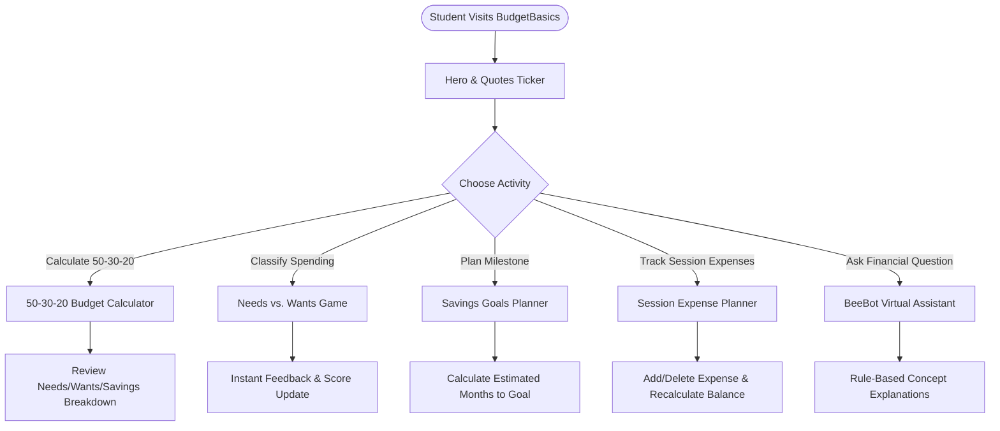
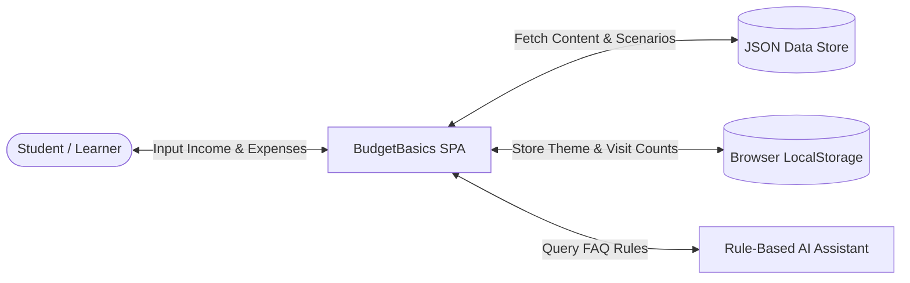

# BUDGETBASICS — PROJECT REPORT
### TechWiz 7: The World Tech Championship
**Category:** Web Innovation Unleashed  
**Theme:** NextGen BudgetBee  
**Project Name:** BudgetBasics (Interactive Student Financial Literacy Hub)  
**Document Version:** 1.0  

---

## 1. Executive Summary & Problem Definition

### 1.1 Problem Statement
College and university students frequently manage their first independent incomes—whether through family allowances, campus jobs, academic scholarships, or summer internships—without structured financial literacy training. Lacking simple, relatable tools, young adults easily succumb to:
- Impulse spending triggered by online e-commerce sales.
- "The Latte Factor"—untracked small daily expenditures that accumulate into hundreds of dollars monthly.
- "Zombie" auto-renewing subscriptions for unused apps or streaming tiers.
- A critical absence of starter emergency cash buffers, forcing reliance on credit card balances during unexpected medical or equipment crises.

### 1.2 Proposed Solution: BudgetBasics
BudgetBasics is an educational, responsive Single Page Application (SPA) designed specifically for students and beginners. Built around the *NextGen BudgetBee* theme, the portal features:
1. **Budgeting Fundamentals & Real-World Student Case Studies:** Clean conceptual breakdowns of fixed vs. variable costs and sample \$1,200 monthly budgets.
2. **Interactive Needs vs. Wants Classification Game:** Gamified decision-making engine with immediate rationale and a 3-step impulse purchase filter.
3. **50-30-20 Rule Real-Time Calculator:** Input validation, visual progress bars, and percentage breakdown (50% Needs, 30% Wants, 20% Savings).
4. **Savings Goals Timeline Estimator:** Calculates remaining targets and timeline to completion with milestone guidance.
5. **Session-Based Interactive Expense Planner:** Real-time logging, categorization, total computation, and remaining balance calculations without backend storage.
6. **Common Money Mistakes & Corrective Actions:** Expandable accordion scenarios detailing realistic campus situations and actionable fixes.
7. **AI Virtual Financial Learning Guide ("BeeBot"):** Rule-based conversational assistant offering prompt chips and educational guidance.

---

## 2. System Architecture & Technical Compliance

### 2.1 Technical Constraints Compliance (SRS Section 1.5)
- **Zero Server-Side Storage:** Strictly client-side execution. In compliance with contest rules, no banking services, real financial transactions, or persistent personal financial records are stored.
- **Client-Side Form Validation:** Feedback and Contact forms validate input formats entirely in JavaScript and display immediate confirmation states without transmitting sensitive student data.
- **Data Persistence Strategy:** Pre-scripted datasets are stored in `data/budget-data.json`, `data/quiz-questions.json`, and `data/chatbot-faq.json`. Theme preferences and visit counts utilize `localStorage` and `sessionStorage`.

---

## 3. System Diagrams

### 3.1 User Journey Flowchart


### 3.2 Data Flow Diagram (Level 0 DFD)


---

## 4. Module Descriptions & Functional Specifications

| Module ID | Module Name | Implementation File | Key Features |
|---|---|---|---|
| **MOD-01** | Live Clock, Quotes & Dark Theme | `js/main.js` | Ticker rotation, live date/time, dark/light theme switch, visitor counter. |
| **MOD-02** | 50-30-20 Rule Calculator | `js/calculators.js` | Formula outputs, input validation, animated percentage progress bars. |
| **MOD-03** | Savings Goals Planner | `js/calculators.js` | Target vs current calculation, completion months estimate, tip callouts. |
| **MOD-04** | Session Expense Planner | `js/calculators.js` | Category selection, dynamic table, real-time balance computation. |
| **MOD-05** | Needs vs Wants Challenge | `js/learning.js` | Interactive item classification game, score tracking, rationales. |
| **MOD-06** | Money Mistakes & Quiz | `js/learning.js` | Expandable accordion case studies, interactive knowledge check quiz. |
| **MOD-07** | BeeBot Virtual Assistant | `js/chatbot.js` | Question matching, prompt chips, educational disclaimers. |

---

## 5. Team Task Allotment & Work Breakdown

| Team Member Role | Assigned Responsibilities | Status |
|---|---|---|
| **Lead Frontend Developer** | Semantic HTML5, CSS custom properties, Dark Mode styling, responsive layout | Completed |
| **Financial Curriculum Researcher**| Real-world student budget scenarios, quiz questions, 50-30-20 case studies | Completed |
| **JavaScript Algorithm Engineer** | 50-30-20 calculator engine, savings goal math, expense tracker table | Completed |
| **AI Assistant Designer** | BeeBot chatbot prompt chips, rule-based keyword mapping, disclaimers | Completed |
| **QA & Standards Auditor** | WCAG 2.1 AA accessibility audit, form validation tests, cross-browser tests | Completed |

---

## 6. Installation & Execution Guide
1. Navigate to the `BudgetBasics` directory:
   ```bash
   cd "C:\Users\chi huong\Desktop\TechWiz7\BudgetBasics"
   ```
2. Start a local server:
   ```bash
   python -m http.server 3001
   ```
3. Open `http://localhost:3001` in Google Chrome, Mozilla Firefox, Microsoft Edge, or Opera.
