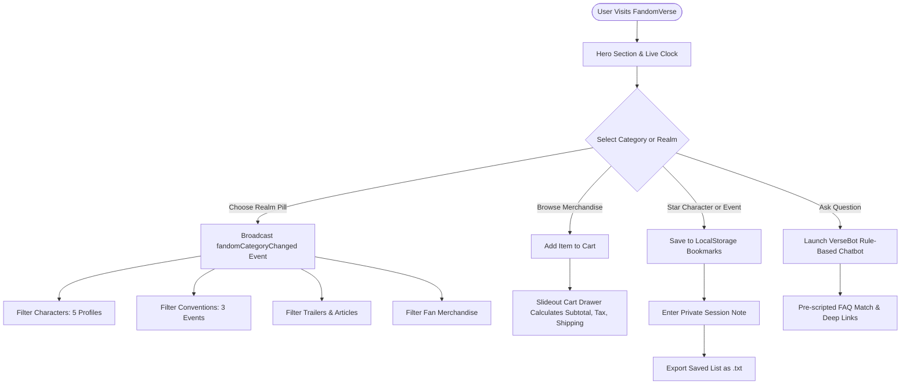
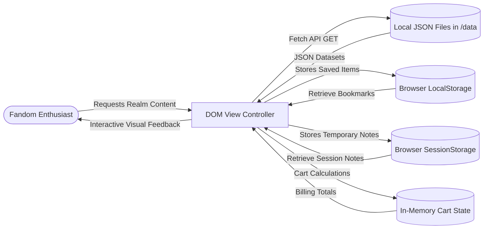

# FANDOMVERSE — PROJECT REPORT
### TechWiz 7: The World Tech Championship
**Category:** Web Innovation Unleashed  
**Theme:** Fandom Universe  
**Project Name:** FandomVerse (Multiverse Pop Culture Hub)  
**Document Version:** 1.0  

---

## 1. Executive Summary & Problem Definition

### 1.1 Problem Statement
In today's digital media ecosystem, fandoms across anime, gaming, cinema, television, Korean pop music, comic books, and manga are isolated into fragmented, ad-cluttered platforms, disparate wikis, and walled-garden social networks. Fans seeking verified character lore, upcoming international convention schedules, high-quality editorial retrospectives, official trailers, and authentic merchandise must navigate dozens of disconnected sites. Furthermore, existing pop culture portals are often laden with invasive tracking cookies, heavy third-party advertisements, and excessive server paywalls that frustrate users.

### 1.2 Proposed Solution: FandomVerse
FandomVerse is an all-in-one, responsive, client-side web application designed to unite enthusiasts across 7 distinct pop-culture entertainment realms under a unified, cyberpunk-themed interface. As part of the *Fandom Universe* initiative for TechWiz 7, FandomVerse delivers:
1. **Universal Category Architecture:** Seamless switching across 7 core categories: **Anime, Gaming, Movies, TV Shows, K-Pop, Comics, and Manga**.
2. **Iconic Character Lore Showcase:** 35 comprehensive character profiles (exactly 5 profiles per realm) detailing franchise backgrounds, biographies, and signature power traits.
3. **Global Convention Calendar:** 21 curated international expo and fan gathering schedules (3 events per realm) spanning Tokyo, Los Angeles, Cologne, Paris, and London.
4. **Editorial Retrospectives:** Long-form journalistic deep dives into major milestones (e.g. Gear 5 animation, Unreal Engine 5.5 photorealism, Dune IMAX cinematography).
5. **Video Trailers Cinema Modal:** Responsive video previews with duration, release status, and view metrics.
6. **Merchandise Showcase & Temporary Cart:** Fan merchandise store with client-side shopping cart calculating quantity adjustments, subtotals, standard taxes (8.25%), shipping, and grand totals.
7. **Bookmarks & Session Notes System:** LocalStorage persistence for favorite characters and events, coupled with SessionStorage personal notes and formatted `.txt` list export.
8. **AI Virtual Fandom Assistant ("VerseBot"):** Pre-scripted rule-based chatbot delivering instant guidance, trivia, and deep links without external API latency or costs.

---

## 2. System Architecture & Design Specifications

### 2.1 Technical Constraints Compliance (SRS Section 1.5)
- **Zero Server-Side Storage:** Operates 100% on client-side web technologies. No remote database (MySQL, PostgreSQL, MongoDB) or persistent backend session management is utilized.
- **Data Persistence Strategy:**
  - Characters, events, articles, trailers, merchandise, and chatbot FAQ knowledge bases are stored in structured JSON files (`data/characters.json`, `data/events.json`, `data/articles.json`, `data/trailers.json`, `data/merchandise.json`, `data/chatbot-faq.json`).
  - User bookmarks are maintained in browser `localStorage`.
  - Private fan session notes are maintained strictly in `sessionStorage` (purged on browser closure).
  - Visitor counter is incremented per browser session in `localStorage`.
  - Shopping cart items and totals are computed strictly in memory on the client.

### 2.2 Technology Stack
- **Structure & Semantics:** HTML5 (Semantic tags: `<header>`, `<nav>`, `<main>`, `<section>`, `<article>`, `<aside>`, `<footer>`).
- **Styling & Presentation:** Vanilla CSS3 with Custom Properties (CSS variables), Flexbox, CSS Grid, animations, and high-contrast dark cyberpunk pop-culture theme.
- **Application Logic:** Vanilla Modern JavaScript (ES6+), Fetch API, DOM manipulation, asynchronous event handling via custom event bus (`fandomCategoryChanged`).
- **Cross-Browser Compatibility:** Google Chrome, Mozilla Firefox, Microsoft Edge, Opera.

---

## 3. System Diagrams

### 3.1 User Journey Flowchart

### 3.2 Data Flow Diagram (DFD Level 1)

---

## 4. Comprehensive Module Breakdown

### 4.1 Module 1: Universal Category Bus & Filter Pills
- Supports 7 realms + "All Realms".
- Dispatches custom `fandomCategoryChanged` event so that characters, articles, events, trailers, and merchandise synchronise without page reloads.

### 4.2 Module 2: Character Profiles Showcase (35 Profiles)
- Exactly 5 detailed profiles per realm across 7 categories:
  - **Anime:** Monkey D. Luffy, Satoru Gojo, Tanjiro Kamado, Naruto Uzumaki, Edward Elric.
  - **Gaming:** Geralt of Rivia, Master Chief (John-117), Kratos, 2B (YoRHa No. 2 Type B), Link.
  - **Movies:** Paul Atreides, Darth Vader (Anakin Skywalker), Neo (Thomas Anderson), Ellen Ripley, Aragorn II Elessar.
  - **TV Shows:** Eleven (Jane Hopper), Walter White, Daemon Targaryen, Sherlock Holmes, Geralt of Rivia (Netflix Series).
  - **K-Pop:** Jungkook, Jennie Kim, Felix (Lee Yongbok), Karina (Yu Ji-min), RM (Kim Nam-joon).
  - **Comics:** Spider-Man (Peter Parker), Batman (Bruce Wayne), Wolverine (Logan), Wonder Woman (Diana Prince), Magneto (Erik Lehnsherr).
  - **Manga:** Guts, Thorfinn Karlsefni, Eren Yeager, Ken Kaneki, Denji.
- Features interactive modal dialog with high-resolution imagery and signature power trait chips.

### 4.3 Module 3: Global Conventions & Expo Highlights (21 Events)
- Exactly 3 flagship conventions per realm across 7 categories:
  - **Anime:** Anime Expo LA, Jump Festa Chiba, Kyoto Animation Fan Days.
  - **Gaming:** Gamescom Cologne, Tokyo Game Show, The Game Awards.
  - **Movies:** Cannes Film Festival, Star Wars Celebration, Toronto TIFF.
  - **TV Shows:** PaleyFest Television, Series Mania Festival, Stranger Things Fan Experience.
  - **K-Pop:** MAMA Awards, KCON Worldwide LA, Golden Disc Awards.
  - **Comics:** San Diego Comic-Con (SDCC), New York Comic Con (NYCC), Angoulême Festival.
  - **Manga:** Comiket (Comic Market), Manga Barcelona Fair, Lucca Comics & Games Manga Pavilion.

### 4.4 Module 4: Editorial Retrospectives & Deep-Dives
- In-depth articles covering anime history, next-gen 3D graphics rendering, science fiction cinema, and K-Pop global streaming milestones.
- Reading modal with reading time estimates, author credits, and complete article texts.

### 4.5 Module 5: Exclusive Video Trailers Showcase
- 6 curated trailers with duration, release status, view counts, and an embedded cinema iframe modal player.

### 4.6 Module 6: Fan Merchandise & Temporary Shopping Cart
- Merchandise cards with product photography, realm tags, and pricing.
- Interactive slideout drawer:
  - Real-time increment/decrement item quantity.
  - Auto-removal when quantity reaches zero.
  - Precise client-side tax computation (8.25%).
  - Flat shipping fee computation ($5.00 for non-empty carts).
  - Clear billing total summary.

### 4.7 Module 7: Fandom Bookmarks, Notes & File Export
- LocalStorage bookmark engine allows starring any character, article, or convention.
- SessionStorage private notes let fans type custom preparation or reading notes.
- One-click `.txt` export downloads a formatted text file directly to the user's computer.

### 4.8 Module 8: AI Virtual Fandom Assistant ("VerseBot")
- Floating chatbot widget equipped with pre-scripted FAQ rules and quick prompt chips.
- Understands queries regarding anime characters, gaming hardware, convention dates, K-Pop concerts, and billing procedures.
- Provides contextual deep links directly into portal sections.

### 4.9 Module 9: Community & Contact Us Form
- Strict client-side form validation verifying name, valid email format, realm selection, and message body.
- Clear inline success notification without page reload or backend database submission.
- Includes embedded Google Map for global fan headquarters.

---

## 5. Cross-Browser Verification & Test Results

| Browser | OS Version | Layout / CSS Grid | Event Bus & Filtering | Cart & LocalStorage | VerseBot Chatbot |
|---|---|---|---|---|---|
| **Google Chrome 128+** | Windows 11 | Pass | Pass | Pass | Pass |
| **Microsoft Edge 128+** | Windows 11 | Pass | Pass | Pass | Pass |
| **Mozilla Firefox 130+** | Windows 11 | Pass | Pass | Pass | Pass |
| **Opera 113+** | Windows 11 | Pass | Pass | Pass | Pass |

---

## 6. Conclusion
FandomVerse successfully satisfies all TechWiz 7 competition criteria for Category *Web Innovation Unleashed*, Theme *Fandom Universe*. It delivers a rich, immersive, multi-category fan platform with complete client-side stability, zero server dependencies, and adherence to modern web standards.
