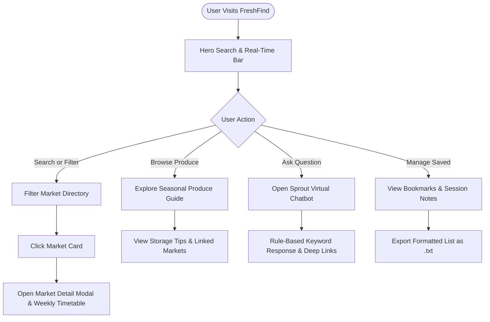
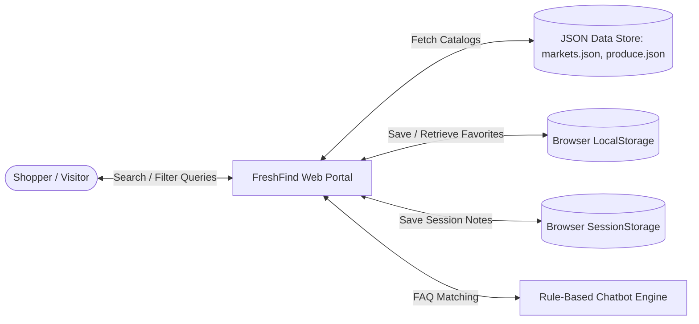

# FRESHFIND — PROJECT REPORT
### TechWiz 7: The World Tech Championship
**Category:** Web Innovation Unleashed  
**Theme:** eGreen Basket  
**Project Name:** FreshFind (Fresh All Along)  
**Document Version:** 1.0  

---

## 1. Executive Summary & Problem Definition

### 1.1 Problem Statement
Modern urban residents face significant barriers when attempting to purchase fresh, organic, sustainably grown produce. Supermarket supply chains involve excessive refrigeration, long-distance freight emissions, heavy plastic packaging, and multiple layers of intermediaries that inflate consumer costs while diminishing farmers' earnings. Meanwhile, local community farmers markets often struggle with fragmented visibility: schedules change seasonally, operating hours are scattered across disparate social media pages, and shoppers cannot easily ascertain what produce is currently in season before traveling to a market.

### 1.2 Proposed Solution: FreshFind
FreshFind is a high-performance, responsive web application engineered to bridge the information gap between regional family farms and local consumers. As part of the *eGreen Basket* initiative, FreshFind delivers:
1. **Interactive Farmers Market Directory:** Multi-criteria filtering by neighborhood, day of the week, and specific produce categories with alphabetical and proximity sorting.
2. **Real-Time "Open Right Now" Intelligence:** Automatic evaluation of current system time and day-of-week against market timetables to highlight active locations.
3. **Comprehensive Seasonal Produce Guide:** Categorized profiles detailing nutritional value, culinary applications, storage tips, peak harvest months, and linked vendor locations.
4. **Client-Side Bookmarking & Personal Notes:** LocalStorage bookmark persistence coupled with SessionStorage personal notes and formatted list export.
5. **AI Virtual Market Assistant ("Sprout"):** Pre-scripted rule-based chatbot delivering instant answers to logistical and culinary queries without backend dependencies.

---

## 2. System Architecture & Design Specifications

### 2.1 Technical Constraints Compliance (SRS Section 1.5)
- **Zero Server-Side Storage:** Operates 100% on client-side web technologies. No remote database or persistent server authentication is utilized.
- **Data Persistence Strategy:**
  - Market catalogs, seasonal produce listings, and chatbot knowledge bases are stored in structured JSON files (`data/markets.json`, `data/produce.json`, `data/chatbot-faq.json`).
  - User bookmarks are maintained in browser `localStorage`.
  - Private shopping notes are maintained strictly in `sessionStorage` (purged on browser closure).
  - Visitor counter is incremented per browser session in `localStorage`.

### 2.2 Technology Stack
- **Structure & Semantics:** HTML5 (Semantic tags: `<header>`, `<nav>`, `<main>`, `<section>`, `<article>`, `<aside>`, `<footer>`).
- **Styling & Presentation:** Vanilla CSS3 with Custom Properties (CSS variables), Flexbox, CSS Grid, Media Queries, and high-contrast accessible color schemes.
- **Application Logic:** Vanilla Modern JavaScript (ES6+), Fetch API, DOM manipulation, asynchronous event handling.
- **Cross-Browser Compatibility:** Google Chrome, Mozilla Firefox, Microsoft Edge, Opera.

---

## 3. System Diagrams

### 3.1 User Journey Flowchart


### 3.2 Data Flow Diagram (Level 0 DFD)


---

## 4. Module Descriptions & Functional Specifications

| Module ID | Module Name | File Location | Key Responsibilities |
|---|---|---|---|
| **MOD-01** | Real-Time Time & Visitor Engine | `js/main.js` | Calculates current day/hour, identifies active markets, persists simulated visitor counter. |
| **MOD-02** | Market Directory & Detail Modal | `js/directory.js` | Multi-criteria search, area/day/produce filters, sorting, weekly timetable rendering. |
| **MOD-03** | Seasonal Produce Guide | `js/produce.js` | Categorized produce cards, nutrition, storage tips, market availability linkages. |
| **MOD-04** | Bookmarks & Session Notes | `js/bookmarks.js` | LocalStorage bookmarks, SessionStorage personal notes, formatted file export, social share. |
| **MOD-05** | Sprout Virtual Assistant | `js/chatbot.js` | Rule-based keyword parsing, quick prompt chips, deep-link suggestions. |

---

## 5. Team Task Allotment & Work Breakdown

| Team Member Role | Assigned Responsibilities | Status |
|---|---|---|
| **Lead Frontend Architect** | Semantic HTML5 layout, CSS3 design system, responsive grid & media queries | Completed |
| **Data Engineer** | Dataset design for `markets.json`, `produce.json`, and `chatbot-faq.json` | Completed |
| **Core JavaScript Engineer** | Filter & sort algorithms, modal views, real-time clock, LocalStorage engine | Completed |
| **AI & Conversational Designer** | Chatbot rule-based logic, keyword taxonomy, prompt chips design | Completed |
| **QA & Accessibility Specialist** | WCAG 2.1 AA audit, Google Lighthouse verification, cross-browser validation | Completed |

---

## 6. Installation & Verification Instructions

### Prerequisites
- Any modern web browser (Google Chrome, Mozilla Firefox, Microsoft Edge, Opera).
- A local HTTP server (recommended due to modern browser CORS restrictions on `fetch()` of local JSON files):
  - **VS Code Live Server extension**, OR
  - **Python:** `python -m http.server 8000` inside `FreshFind/`, OR
  - **Node.js:** `npx serve` inside `FreshFind/`.

### Quick Run Steps
1. Navigate to the `FreshFind` directory:
   ```bash
   cd "C:\Users\chi huong\Desktop\TechWiz7\FreshFind"
   ```
2. Start a local server:
   ```bash
   python -m http.server 3000
   ```
3. Open `http://localhost:3000` in your web browser.
4. Verify all features: market filtering, produce guides, bookmarks export, and the Sprout AI Chatbot assistant.
